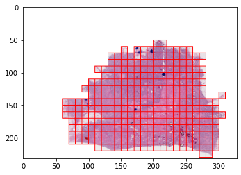

Dataset examples
================

.. code-block:: python

    from dlup.data.dataset import TiledROIsSlideImageDataset
    from dlup import SlideImage
    import matplotlib.pyplot as plt
    from PIL import Image, ImageDraw
    import numpy as np
    from dlup.background import get_mask

    INPUT_FILE_PATH = "TCGA-B6-A0IG-01Z-00-DX1.4238CB6E-0561-49FD-9C49-9B8AEAFC4618.svs"
    slide_image = SlideImage.from_file_path(INPUT_FILE_PATH)

    # Level 0 ROI size
    ROI_SIZE = (30000, 20000)
    ROI_COORDINATES = (100000, 50000)
    TILE_SIZE = (10, 10)
    TARGET_MPP = 100

    # Generate the mask
    mask = get_mask(slide_image)
    scaled_region_view = slide_image.get_scaled_view(slide_image.get_scaling(TARGET_MPP))

    dataset = TiledROIsSlideImageDataset.from_standard_tiling(INPUT_FILE_PATH, TARGET_MPP, TILE_SIZE, (0, 0), mask=mask)
    background = Image.new("RGBA", tuple(scaled_region_view.size), (255, 255, 255, 255))

    for d in dataset:
        tile = d["image"]
        coords = np.array(d["coordinates"])
        pil_image = Image.fromarray(tile)
        box = tuple(np.array((*coords, *(coords + TILE_SIZE))).astype(int))
        background.paste(pil_image, box)
        draw = ImageDraw.Draw(background)
        draw.rectangle(box, outline="red")

    plt.figure()
    plt.imshow(background)
    plt.show()

