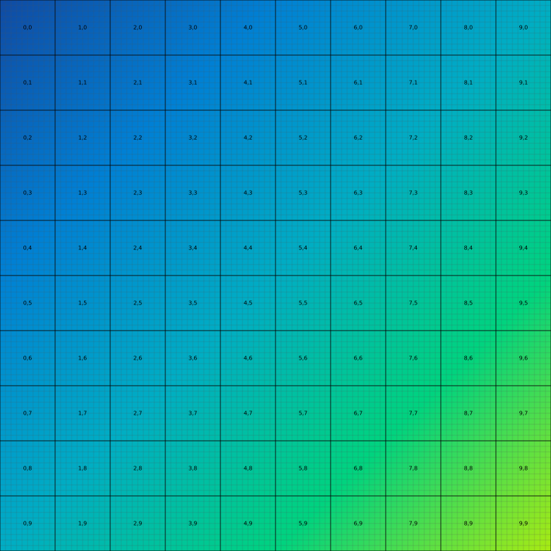

.. role:: bash(code)
   :language: bash

Quick Start
===========
If the :doc:`/installation` went smoothly, you should be able to run :bash:`dlup --help` and see:

.. code-block:: console

    usage: dlup [-h] {wsi} ...

    positional arguments:
      {wsi}  Possible DLUP CLI utils to run.
        wsi             WSI parser

    optional arguments:
      -h, --help        show this help message and exit

Let's now get a sample **.svs** slide image. You can easily generate one using the tool `svg2svs`_,
which should look like this:

Command Line Interface
--------------------------
Using dlup cli we can very simply query the properties of this mock image using :bash:`dlup wsi info checkerboard.svs`.
Here the example output:

.. code-block:: console

    aperio.AppMag   40
    aperio.MPP      0.062500
    openslide.comment       Aperio Image Library v11.1.9
    16000x16000 (256x256) JPEG/RGB Q=100;Mirax Digital Slide|AppMag = 40|MPP = 0.062500
    openslide.level-count   4
    openslide.level[0].downsample   1
    openslide.level[0].height       16000
    openslide.level[0].tile-height  256
    openslide.level[0].tile-width   256
    openslide.level[0].width        16000
    openslide.level[1].downsample   4
    openslide.level[1].height       4000
    openslide.level[1].tile-height  256
    openslide.level[1].tile-width   256
    openslide.level[1].width        4000
    openslide.level[2].downsample   16
    openslide.level[2].height       1000
    openslide.level[2].tile-height  256
    openslide.level[2].tile-width   256
    openslide.level[2].width        1000
    openslide.level[3].downsample   64
    openslide.level[3].height       250
    openslide.level[3].tile-height  256
    openslide.level[3].tile-width   256
    openslide.level[3].width        250
    openslide.mpp-x 0.0625
    openslide.mpp-y 0.0625
    openslide.objective-power       40
    openslide.quickhash-1   076e18dbe8ea95b709b05e94c0ccfeea8e595e60d7e926a5bf0b8eabba288fa6
    openslide.vendor        aperio
    tiff.ImageDescription   Aperio Image Library v11.1.9
    16000x16000 (256x256) JPEG/RGB Q=100;Mirax Digital Slide|AppMag = 40|MPP = 0.062500
    tiff.ResolutionUnit     inch

If necessary, you can also save these properties as a json file
via :bash:`dlup wsi info --json checkerboard.svs > props.json`.

Alternatively, we can easily tile a whole-slide image using:

.. code-block:: console

    dlup wsi tile checkerboard.svs . --tile-size=256 --mpp 1 --foreground-threshold=0 --crop --mode=skip

This will generate a set of tiles of size 256, microns per pixel equal to 1.0, and no tile will
be considered background. :code:`--model=skip` means the program will skip the last overflowing tile.
For more information about tiling modes consult the :doc:`/tiling` page.

Python Package
--------------
The main dlup classes are *SlideImage* and *SlideImageDataset*.

*SlideImage* represents a single whole slide image. You can instantiate it by using the path to the WSI file with:

.. code-block:: python

    import dlup
    wsi = dlup.SlideImage.from_file_path("checkerboard.svs")

A *SlideImage* object abstracts a discrete-layers pyramidal image as a continuous pyramid.
This means that you don't have to worry about levels, and can request a specific region at an arbitrary
magnification. For instance, you can extract a top-left square-region of 64 pixels
at half-native resolution with:

.. code-block:: python

    region = PIL.Image.fromarray(wsi.read_region((0, 0), 0.5, (64, 64)))

*SlideImageDataset* makes it easy to fetch tiles within a WSI by specifying their size, overlap, and other properties.
For instance, we can initialize a dataset which will fetch tiles of size 256 by 256 pixels, with an overlap of
32 pixels, and half-native resolution, with:

.. code-block:: python

    wsi_dataset = dlup.data.SlideImageDataset(
        path="checkerboard.svs",
        mpp=0.5,
        tile_size=256,
        tile_overlap=32
    )

Now that you went through the basic features, feel free to read more in-depth sections of this document.

.. _svg2svs: https://github.com/Ellogon/svg2svs
