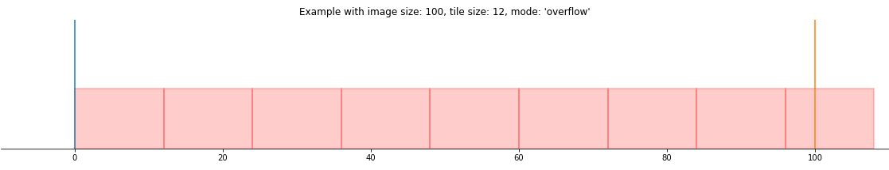

Tiling
======
To tile a *SlideImage* object, dlup offers a set of convenient settings
to achieve the most common use cases.

Mode
----
Dlup currently offers three policies to deal with overflowing tiles during dataset generation.
In this section we'll provide visual examples of the three modalities.

Skip
****
As the name suggests, this policy skips the last tile if it was going to overflow beyond the slide boundary.

.. figure:: img/skip.png

Overflow
********
This policy pads the bottom and right border of the slide with zeros, so that the last row and the last column
will contain zero-padded tiles. This will ensure that their size is consistent with all other tiles.

Crop
^^^^
This is an additional option that may be included with the :code:`--crop` flag when using :code:`dlup wsi tile`.
It defines whether overflowing tiles should be cropped (as opposed to zero-padded).
