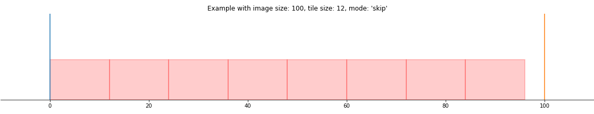

Tiling
======

To tile an *SlideImage*, dlup offers a set of convenient settings
to achieve the most common usecases.

Mode
----

Dlup in the dataset generation currently offers three policies to deal
with overflowing tiles.
In this section we'll explore visually these three differen modalities.

Skip
****

As the name suggests, this policy ignores the last tile if it was going to overflow.

Overflow
********

Pads with zeros the bottom and right border of the image.

.. figure:: img/overflow.png

Crop
^^^^

Defines if the last tile should be cropped or not.

Fit
***

Adapts the overlap as uniformly as possible such that the tiles will fit in the image canvas.
The striding of the tiles is might not be uniform.

.. figure:: img/fit.png
